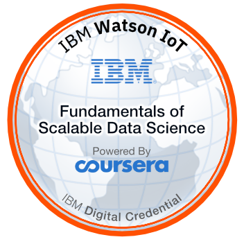

# **Advanced Data Science with IBM Specialization**
> ## **Assignments and Problem Sets**
Fundamentals of Scalable Data Science Badge

#### About this specialization : 
   *According to Coursera*, as a coursera certified specialization completer you will have a proven deep understanding on massive parallel data processing, data exploration and visualization, and advanced machine learning &amp; deep learning. You'll understand the mathematical foundations behind all machine learning &amp; deep learning algorithms. You can apply knowledge in practical use cases, justify architectural decisions, understand the characteristics of different algorithms, frameworks &amp; technologies &amp; how they impact model performance &amp; scalability.
   
## [Course 1 : Fundamentals of Scalable Data Science](/Fundamentals-of-Scalable-Data-Science)
> ### Week 1 : Introduction to exploratory analysis
> Challenges, terminology, methods and technology
- [Assignment 1](/Fundamentals-of-Scalable-Data-Science/Week1/Assignment1)
> ### Week 2 : Tools that support IoT solutions
> Data storage solutions, and ApacheSpark  
> Programming language options and functional programming  
> ApacheSparkSQL, Cloudant, and the End to End Scenario
- [Assignment 2](/Fundamentals-of-Scalable-Data-Science/Week2/Assignment2.1)
> ### Week 3 : Mathematical Foundations on Exploratory Data Analysis
> Averages and standard deviation  
> Skewness and kurtosis  
> Covariance, correlation and multidimensional Vector Spaces  
- [Assignment 3](/Fundamentals-of-Scalable-Data-Science/Week2/Assignment3.1.py)
> ### Week 4 : Data Visualization
> Visualization  
> Dimension Reduction
- [Assignment 4](/Fundamentals-of-Scalable-Data-Science/Week2/Assignment4.1.py)
