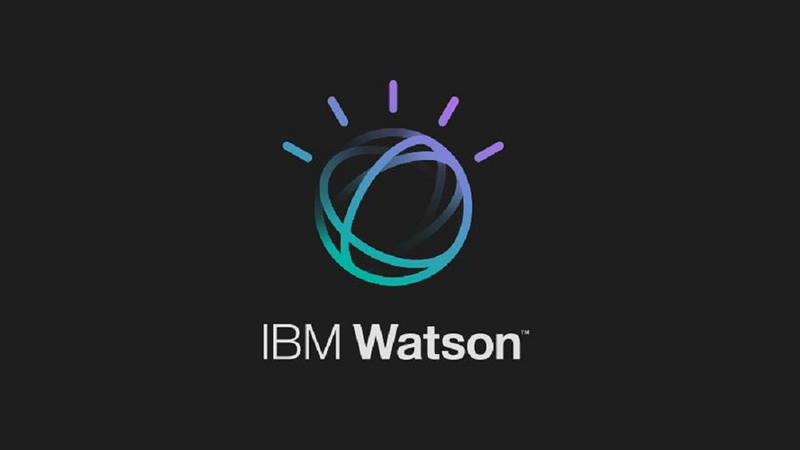

# **Advanced Data Science with IBM Specialization**
> ## **Assignments and Problem Sets**

#### About this specialization : 
   *According to Coursera*, as a coursera certified specialization completer you will have a proven deep understanding on massive parallel data processing, data exploration and visualization, and advanced machine learning &amp; deep learning. You'll understand the mathematical foundations behind all machine learning &amp; deep learning algorithms. You can apply knowledge in practical use cases, justify architectural decisions, understand the characteristics of different algorithms, frameworks &amp; technologies &amp; how they impact model performance &amp; scalability.
   
## [Course 1 : Fundamentals of Scalable Data Science](/Fundamentals-of-Scalable-Data-Science)
>> ### Week 1 : Introduction to exploratory analysis
      [Assignment 1](/Fundamentals-of-Scalable-Data-Science/Week1/Assignment1.py)
